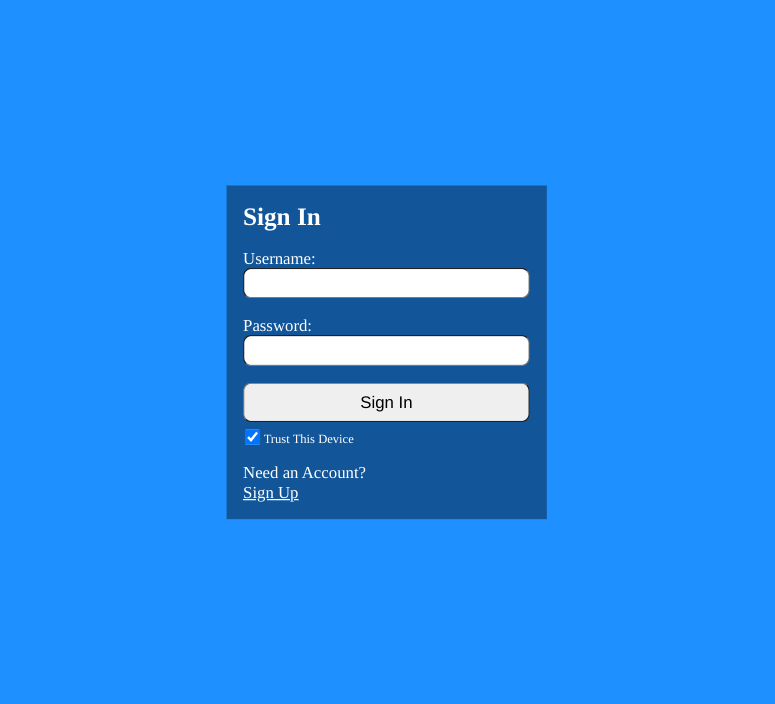
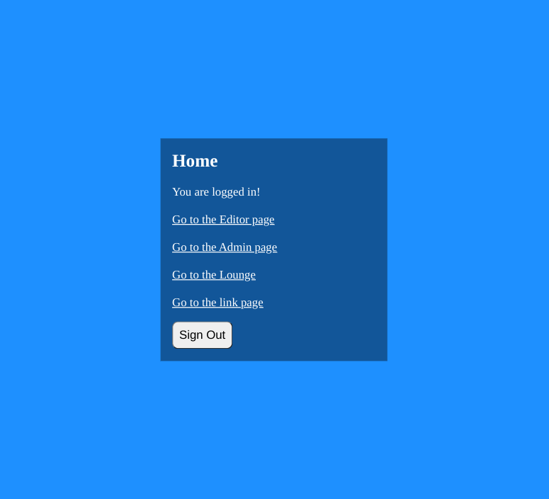
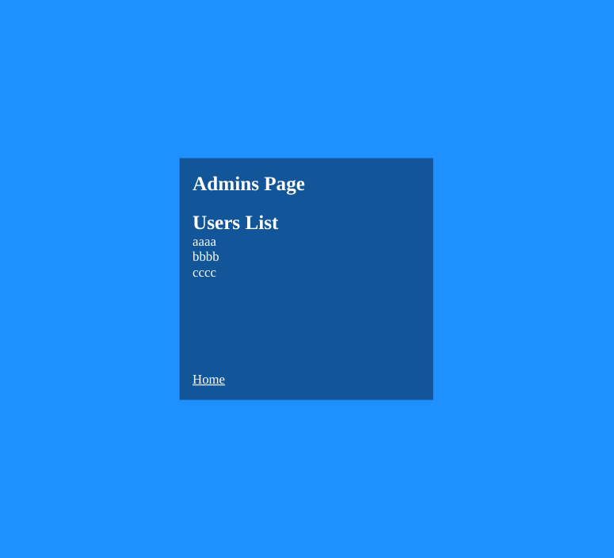
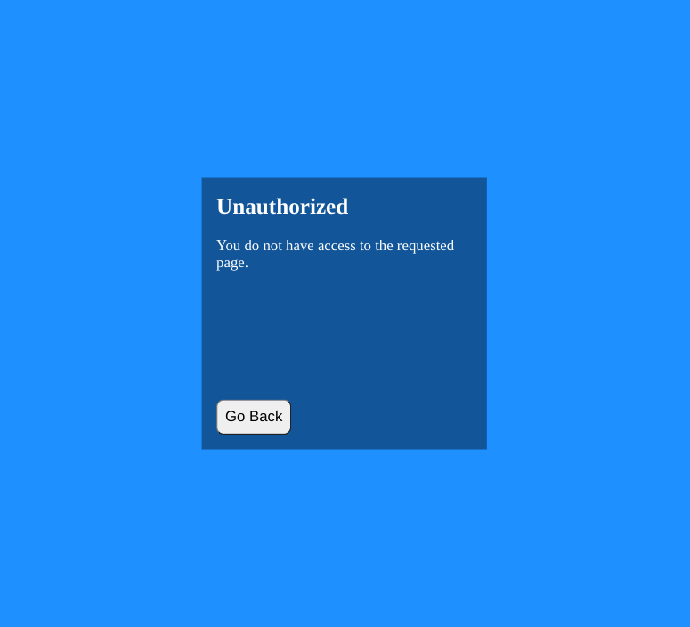

# React Register Tut

## Table of Contents

- [Overview](#overview)
  - [Built With](#built-with)
- [Screenshots](#screenshots)
- [Thoughts](#thoughts)
- [How to use](#how-to-use)
- [Useful Resources](#useful-resources)

## Overview

This is a completed result from this [tutorial series](https://www.youtube.com/playlist?list=PL0Zuz27SZ-6PRCpm9clX0WiBEMB70FWwd).
The videos used include: 
- React JS Form Validation
- React User Login and Authentication with Axios
- React Protected Routes | Role-Based Authorization | React Router v6
- React Login Authentication with JWT Access, Refresh Tokens, Cookies and Axios
- React Persistent User Login Authentication with JWT Tokens
- Best Practices for React Data Security, Logins, Passwords, JWTs

## Screenshots

### Built With

- axios
- jwt-decode
- react
- react-router-dom

## Thoughts 

- Versus installing react-icons -> I just used a unicode character.  
- Doing this without axios seems much more difficult and probably more error prone.  
- I could use more practice with axios and some of its advanced features.
- I didn't add a disable react-dev-tools package.  
- Strict Mode prevents the users list from displaying.  

## Useful Resources

- [Unicode Table](https://unicode-table.com/en/2713/) - checkmark
